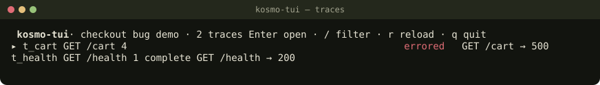
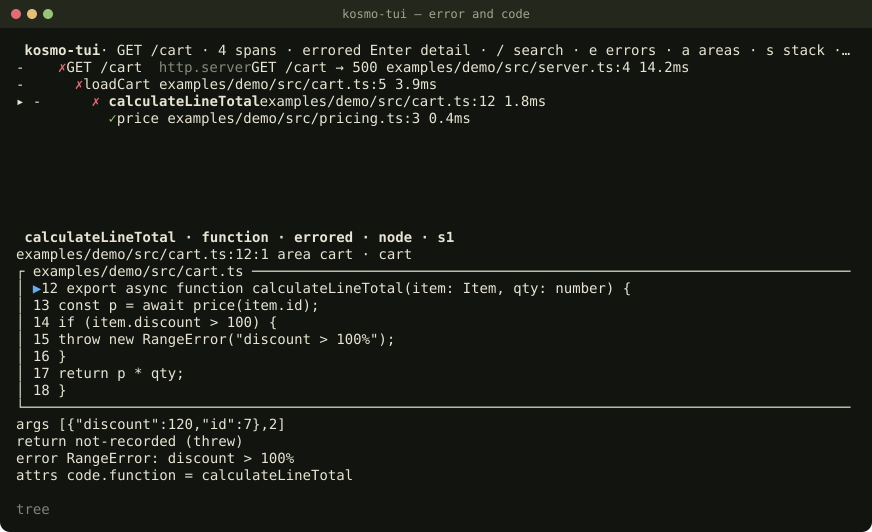
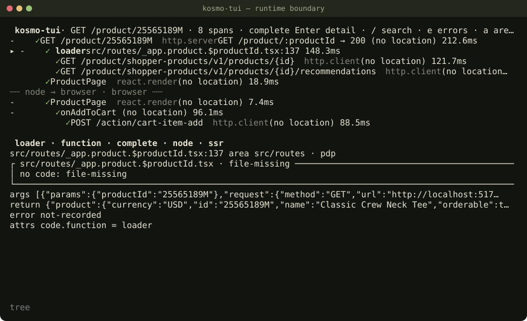

# @ivlad003/kosmo-tui

Terminal viewer and live debugger for kosmo-trace call traces. It answers one question: **which logic and which piece of code does
every call belong to**. A span carries its exact place in the code, the detail pane shows that code from disk, calls
are grouped by module and feature, and framework calls (Express middleware, Nest enhancers, React render/effect, the
Next server/client boundary) have readable names.

kosmo-tui reads its own format, `kosmo-trace/v1`, from a JSON file, an NDJSON file or stream, or a SQLite store. It
has no runtime dependencies and never writes to a trace. The usage guide, including what it does not solve, is
[docs/index.html](docs/index.html) (Ukrainian; also published on GitHub Pages).

```sh
npx @ivlad003/kosmo-tui                        # start screen: traces found here and recently opened
npx @ivlad003/kosmo-tui ./x.kosmo-trace.json    # open a file (.json, .ndjson or .sqlite)
producer | npx @ivlad003/kosmo-tui -            # NDJSON on stdin, keys from the terminal
kosmo-tui ./x.kosmo-trace.json --print --trace t_cart          # kosmo-text/v1
kosmo-tui ./x.kosmo-trace.sqlite --print json                   # normalized kosmo-trace/v1
```

Requires Node >= 22.13.0 (the built-in `node:sqlite`). `kosmo-tui --help` lists every flag.

From a checkout, the demo trace opens with its code:

```sh
npm ci && npm run build
node bin/kosmo-tui.js examples/demo.kosmo-trace.json
```

## Screens

**Start screen** (`kosmo-tui` without arguments): `*.kosmo-trace.json|ndjson|sqlite` files in the current directory and
two levels below (without `node_modules`, `.git` and hidden directories), then up to 20 recently opened paths from
`$XDG_CONFIG_HOME/kosmo-tui/recent.json` (or `~/.config/kosmo-tui/recent.json`). Files are only listed, never opened,
until you press Enter. A file that is gone shows `file-not-found`; an open error is a banner and you stay on the start
screen. `-r` never writes `recent.json`. If the home directory cannot be determined and `$XDG_CONFIG_HOME` is not set,
the recent list is off and a banner says so.

**Traces screen**: every trace of the dataset with its span count and status; a trace with `http.server` spans also
shows `METHOD route → status` of its first request and `N requests` when there are several. A dataset with one trace
skips this screen.



```
 kosmo-tui · checkout bug demo · 2 traces Enter open · / filter · r reload · q …
 ▸ t_cart               GET /cart                      4  errored     GET /cart…
   t_health             GET /health                    1  complete    GET /heal…
```

**Trace screen**: the call tree in the order of the format (never re-sorted), the detail of the selected span below
it, with the code window read from the project root. The `▶` line is always visible, even at 40×10.

```
 kosmo-tui · GET /cart · 4 spans · errored Enter detail · / search · e errors ·…
   - ✗ GET /cart http.server GET /cart → 500  examples/demo/src/server.ts:4  14…
     - ✗ loadCart  examples/demo/src/cart.ts:5  3.9ms
 ▸     - ✗ calculateLineTotal  examples/demo/src/cart.ts:12  1.8ms
           ✓ price  examples/demo/src/pricing.ts:3  0.4ms

 calculateLineTotal · function · errored · node · s1
 examples/demo/src/cart.ts:12:1  area cart · cart
 ┌ examples/demo/src/cart.ts ───────────────────────────────────────────────────
 │▶ 12  export async function calculateLineTotal(item: Item, qty: number) {
 │  13    const p = await price(item.id);
 │  14    if (item.discount > 100) {
 │  15      throw new RangeError("discount > 100%");
 │  16    }
 │  17    return p * qty;
 └ … ───────────────────────────────────────────────────────────────────────────
 args    [{"discount":120,"id":7},2]
 return  not-recorded (threw)
 error   RangeError: discount > 100%
   attrs   code.function = calculateLineTotal
```



The code window names its state when the file does not match the trace: `file-missing`, `outside-root` (a symlink
leaves the root), `root-changed` (the root directory now resolves elsewhere, say it was swapped for a symlink),
`too-large` (over 2 MiB), `unreadable`, `not-text`, `changed-since-trace`, or `moved to line N` (the recorded
snippet was found within 40 lines). The root is `--root` or `:root` (taken as given, stored as its real path), else
`dataset.root` when it is an absolute path to a directory that (by real path) is or contains the current directory
or the trace file's directory, else the nearest directory with `.git` or `package.json` above the trace file, else
the current directory. None of these automatic choices may be `/`, your home directory or a directory above it: a
`dataset.root` that fails is ignored and the status line says `dataset.root ignored (…)`; a marker directory that
fails passes to the current directory; and when the current directory fails too (say `cd ~` first) there is no root.
Then no code is read from disk, file links are off, the code window says `no code root`, and the status line says
`code root not set: …; use :root or --root`.

A child whose session or runtime differs from its parent's gets a separator row: `┄┄ browser → node · n1 ┄┄`.



**Areas** (`a`) lists `module · feature` with span and error counts; derived areas (from the file's directory, or the
package name inside `node_modules`) are marked `~`. Enter filters the tree to an area, with ancestors dimmed.

## Keys

| Key                                    | Action                                                                             |
| -------------------------------------- | ---------------------------------------------------------------------------------- |
| `j` `k` ↑ ↓ PgUp PgDn `g` `G` Home End | Move                                                                               |
| `h` `l` Space                          | Collapse / expand / toggle                                                         |
| Enter                                  | Open the file or trace; on the tree: focus the detail (it scrolls)                 |
| Tab / Esc                              | Back to the tree / close the pane, clear the filter, go back                       |
| `T` Backspace                          | From the trace back to the trace list                                              |
| `v` `d`                                | Tree ↔ table / kosmo-text view                                                     |
| `/` `e` `a`                            | Search name and file / errors only / Areas                                         |
| `s`                                    | Stack: the recorded ancestors                                                      |
| `m` `'`                                | Bookmark / list bookmarks                                                          |
| `y`                                    | Copy kosmo-text/v1 of the selected subtree (printed after exit when no clipboard)  |
| `>` `r`                                | Next page of traces (SQLite) / read the file again (not for stdin)                 |
| `:`                                    | Command line                                                                       |
| `A` `H` `P`                            | Targets / hits / paused stack. Enter in Targets asks before attach                 |
| `b` `B`                                | Tracepoint (no pause) / breakpoint on the selected span                            |
| `c` `n` `o` `s`                        | While paused: continue / step over / step out / step into (`s` in the paused pane) |
| `q` Ctrl+C                             | Quit (Ctrl+C exits 130). Ctrl+Z suspends kosmo-tui; breakpoints stay inactive      |

## Commands

A span ref is `.` (the selection), `<id>`, `<session>:<id>` or `<trace>:<session>:<id>`; an ambiguous ref lists its
candidates instead of guessing. `/re/flags` is a regular expression only in `:find`, `:filter name` and `:area`.

| Command                                                                     | Meaning                                                                     |
| --------------------------------------------------------------------------- | --------------------------------------------------------------------------- |
| `:trace <id>`                                                               | Open a trace                                                                |
| `:ancestors [ref]`                                                          | The parent chain, ending in `root reached`, `parent unknown(…)` or `cycle`  |
| `:path <from> <to>`                                                         | `found`, `no-path` or `unknown-path(<reason>)`                              |
| `:callers [ref]`                                                            | Spans at the same `file:line`, grouped by their parents                     |
| `:find /re/[imsu]`                                                          | Spans whose name or file matches                                            |
| `:filter errors [on\|off] \| name /re/ \| kind <glob> \| area <x> \| clear` | Tree filters (`kind nest.*` keeps the Nest steps)                           |
| `:area <x>`                                                                 | Feature first, then module; `module:<x>` and `feature:<x>` are explicit     |
| `:bookmark [list]`                                                          | Bookmarks                                                                   |
| `:root [<dir>]`                                                             | Show the code root, or change it and re-read the snippets                   |
| `:attach <ip>:<port>`                                                       | Probe a loopback inspector and ask before attach                            |
| `:detach`                                                                   | Remove points and the helper; may offer to close a port opened with SIGUSR1 |
| `:tp <file>:<line> [names]` `:bp <file>:<line> [names] [--same-case]`       | Arm a point in every attached target                                        |
| `:untp <id>` `:unbp <id>` `:tp-cap <n>` `:max-pause <s>\|off`               | Remove a point, cap tracepoint hits (default 100), auto-resume our pauses   |
| `:launch-browser <http://localhost:port/…>`                                 | Launch Chrome/Edge/Chromium with a temporary profile                        |
| `:attach-browser <ip>:<port>` `:reload-armed`                               | Attach to a non-default loopback profile, or reload after points are armed  |
| `:q`                                                                        | Quit                                                                        |

## `--print`

`--print` never opens the terminal UI and never writes a file. Stdin is read to EOF without a deadline. The format
is `--format <format>`, `--print=<format>` or the word after `--print` (`<file> --print json`); when no file is named,
that word is the file (`kosmo-tui --print json --format tab` prints the file `json`). Ctrl+C, SIGINT or SIGTERM stop
it silently with `130` or `143`.

| `--format`       | without `--trace`                                | with `--trace <id>`                                                                  |
| ---------------- | ------------------------------------------------ | ------------------------------------------------------------------------------------ |
| `text` (default) | exit 1: pass `--trace <id>`                      | `kosmo-text/v1`; `--detail 1` (default) adds `args`/`return`/`error`                 |
| `json`           | the normalized `kosmo-trace/v1` document, no cap | the trace and every link with an end in it, no cap                                   |
| `tab`            | `id\tname\tspans\tstatus`                        | one row per span in tree order: `session\tid\tparent\tstatus\tkind\tfile:line\tname` |

`text` and `tab` stop at 51 200 bytes and end with `… truncated: output-byte-cap (shown N of M spans)` (`traces`
for the list). `json` escapes control and bidi characters as `\uXXXX` and writes no field that failed validation, so
its output validates again. Masking (below) applies to every format.

Exit codes: `0` ok · `1` usage, a path that does not exist or is a directory, no controlling terminal · `2` an
unreadable or invalid trace (`too-large`, `not-a-kosmo-trace`, `not-a-kosmo-trace-store`, `unsupported-version`,
`invalid(<position>: <what>)`), a stream stopped by a bad line under `--print` · `130` SIGINT or Ctrl+C · `143`
SIGTERM · `129` SIGHUP.

## The format for producers: `kosmo-trace/v1`

A trace file is a snapshot of finished (or interrupted) calls, not an event log. The JSON Schema is published with the
package: `@ivlad003/kosmo-tui/schema/kosmo-trace-v1.schema.json`.

```jsonc
{
  "format": "kosmo-trace",
  "version": 1,
  "dataset": { "id": "ds_01", "producer": { "name": "my-recorder", "version": "1.2.0" }, "title": "checkout bug" },
  "traces": [{ "id": "t_9f", "name": "GET /cart" }],
  "spans": [
    {
      "trace": "t_9f",
      "session": "s1",
      "id": "sp_3",
      "parent": "sp_1",
      "order": 17,
      "name": "calculateLineTotal",
      "kind": "function",
      "status": "errored",
      "durationMs": 1.8,
      "runtime": "node",
      "location": {
        "file": "src/cart.ts",
        "line": 12,
        "endLine": 20,
        "snippet": "export async function calculateLineTotal(item, qty) {"
      },
      "area": { "module": "src/cart", "feature": "cart" },
      "attrs": { "code.function": "calculateLineTotal" },
      "args": { "state": "recorded", "value": [{ "id": 7 }, 2] },
      "return": { "state": "not-recorded", "reason": "threw" },
      "error": { "state": "recorded", "value": { "name": "RangeError", "message": "discount > 100%" } }
    }
  ],
  "links": [
    {
      "from": { "trace": "t_9f", "session": "s1", "id": "sp_9" },
      "to": { "trace": "t_9f", "session": "s1", "id": "sp_3" },
      "kind": "caused-by"
    }
  ]
}
```

- **Required:** the document's `format`, `version`, `dataset.id` and `spans`; a span's `trace`, `session`, `id`,
  `parent` (a string or `null`), `order`, `name` and `status`. A trace may exist only through `span.trace`; a missing
  `kind` means `function`.
- **Identity** is `(trace, session, id)`: the same id in two sessions is two spans. `order` is the enter order inside
  `(trace, session)`, an integer, unique, never shown as a duration.
- **Parents** are never guessed. `parentSession` names the parent's session exactly; without it the same session is
  tried first, then exactly one span with that id in another session. Anything else is `unknown(missing)` or
  `unknown(ambiguous)`, drawn as a root with a mark; a cycle is cut at its smallest `(session, order)` member.
- **Status:** `complete`, `errored`, `running` (shown as `running (at capture)`), `suspended` (waiting, not an error —
  React Suspense included), `unknown` with `statusReason` (`aborted` for an HTTP request the client closed).
- **Values** (`args`, `return`, `error`): `recorded`, `truncated`, `masked` or `not-recorded` (the default). Inside a
  value, tagged objects carry what JSON cannot: `{"$type":"undefined"}`, `number` (`NaN`, `Infinity`, `-0`),
  `bigint`, `function`, `symbol`, `date`, `map`, `set`, `class`, `accessor`, `hole`, `cycle`, `masked`, and in
  `truncated` also `deeper`, `more` and `string-cut`. A real object with a `$type` key is written as
  `{"$type":"object","entries":{…}}`.
- **Location:** `file` is a relative POSIX path (no `..`, no absolute path, no scheme, no control characters), `line`
  and `column` are 1-based; `snippet` is the text of `line` (at most 512 bytes, `snippetCut: true` when cut). A bad
  location is dropped with `invalid-location`; the span stays.
- **Area:** `module` is a technical boundary, `feature` the business logic. Without an area the viewer derives
  `module` from the file's directory (the package name inside `node_modules`) and never derives a feature.
- **NDJSON** (`.kosmo-trace.ndjson` or stdin): one object per line with a `type` next to the fields — `header` first
  (`{"type":"header","format":"kosmo-trace","version":1,"dataset":{…}}`), then `trace`, `span` and `link` lines in any
  order. A line is at most 1 MiB, the stream at most 64 MiB or 200 000 spans; a bad line stops the stream (the viewer
  keeps what it read and says `stream stopped at line N`).
- **SQLite** (`.kosmo-trace.sqlite`): tables `kosmo_meta`, `kosmo_traces`, `kosmo_spans`, `kosmo_links` (the schema
  is in the design spec, section 4.6), opened read-only; values are read lazily when a span is selected.
- **Limits:** files up to 64 MiB, ids up to 256 bytes, names up to 1024 bytes, value nesting up to 64, a trace up to
  200 000 spans. Unknown fields, NDJSON line types, SQLite tables and columns are ignored; an unknown `status` becomes
  `unknown`, an unknown `runtime` becomes `other`.

### Framework kinds and `attrs`

`kind` is `<framework>.<role>`. Unknown kinds are shown as they are; these get special rendering:

| kind                    | span boundaries                                                                      |
| ----------------------- | ------------------------------------------------------------------------------------ |
| `function` (default)    | call → return / throw / settle                                                       |
| `http.server`           | request received → response `finish`; `close` without `finish` → `unknown(aborted)`  |
| `http.client`           | outgoing `fetch` / `http.request` → response or error                                |
| `express.router`        | a Router layer or sub-app                                                            |
| `express.middleware`    | a `use()` callback with arity ≤ 3: call → first `next()`, `finish` or `close`        |
| `express.handler`       | a route method callback, same boundaries                                             |
| `express.error-handler` | a callback with arity 4 (drawn with `⤳`)                                             |
| `nest.middleware`       | as `express.middleware`                                                              |
| `nest.guard`            | `canActivate` → settle; the boolean result goes to `return` (`→ false (denied)`)     |
| `nest.interceptor`      | `intercept()` → completion, error or unsubscribe; downstream enhancers are children  |
| `nest.pipe`             | `transform` → settle                                                                 |
| `nest.handler`          | the controller method                                                                |
| `nest.filter`           | `catch()` → return (drawn with `⤳`)                                                  |
| `react.render`          | a component function call; suspension is status `suspended`                          |
| `react.effect`          | an effect setup or cleanup                                                           |
| `next.middleware`       | `middleware.ts` (edge or node) or Next 16 `proxy.ts`                                 |
| `next.route-handler`    | an export of `app/**/route.ts`                                                       |
| `next.server-action`    | a `'use server'` action: `runtime: browser` for the client stub, `node` for the body |
| `next.render`           | a route render (RSC/SSR)                                                             |

Rules for producers: one call is exactly one span with the most specific kind; Express/Nest middleware layers are
**siblings** under their router or request, not children of the previous layer; `http.route` is the low-cardinality
template (`/api/orders/:id`); `http.server` is `errored` for 5xx or an uncaught exception and `complete` for 4xx;
framework metadata goes to `attrs`, user values only to `args`/`return`/`error`; raw URLs do not belong in `attrs`.

`attrs` is an object of `key → string | number | boolean` with keys matching
`^[a-z][a-z0-9_-]*(\.[a-z0-9][a-z0-9_-]*)*$` (at most 128 bytes), at most 32 keys, strings up to 512 bytes, 8 KiB in
total. Entries that break a rule are dropped one by one and counted as `invalid-attrs(N)`. The viewer uses
`http.request.method`, `http.route`, `http.response.status_code` and `next.request.type` on `http.server` rows, and
`react.strict_mode.duplicate: true` for a dimmed `⧉strict` row; every other key is listed in the detail pane.

### A producer in 20 lines

<!-- ndjson-producer:start -->

```js
// producer.mjs: node producer.mjs | kosmo-tui -
const emit = (line) => process.stdout.write(`${JSON.stringify(line)}\n`);
let order = 0;
const span = (id, parent, name, fields = {}) =>
  emit({ type: "span", trace: "t1", session: "s1", id, parent, order: order++, name, status: "complete", ...fields });

emit({ type: "header", format: "kosmo-trace", version: 1, dataset: { id: "ds_readme", producer: { name: "readme" } } });
emit({ type: "trace", id: "t1", name: "GET /cart" });
span("req", null, "GET /cart", {
  kind: "http.server",
  attrs: { "http.request.method": "GET", "http.route": "/cart", "http.response.status_code": 200 }
});
span("load", "req", "loadCart", {
  location: { file: "src/cart.ts", line: 5 },
  area: { module: "src/cart", feature: "cart" },
  durationMs: 3.9,
  args: { state: "recorded", value: ["u_42"] },
  return: { state: "recorded", value: { items: 1 } }
});
span("price", "load", "price", {
  location: { file: "src/pricing.ts", line: 3 },
  return: { state: "recorded", value: 12.5 }
});
```

<!-- ndjson-producer:end -->

## Debugger

`A` opens Targets (also with no trace open). Enter asks before attach: kosmo-tui can pause the process and run code in it. `-r` turns every debug action off.

Start the process with an inspector on loopback, not via `NODE_OPTIONS` on a supervisor (`tsx`, `nest`, `next`, `node --watch`): the supervisor would take the port and has no app code. Node: `node --inspect app.js`. TypeScript: compile first (`tsc`) and inspect the output; `tsx` and Node's type strip shift locations. Express is the same as Node. Nest: `nest start` then inspect the child, not the CLI. Next 15.5/16: inspect `next-server`, not the `next dev` supervisor (`NODE_OPTIONS=--inspect` on the supervisor is the trap). Vite / React Router: inspect the dev server, then `◆ launch browser` or `:launch-browser http://localhost:<port>`.

`b` sets a tracepoint (no pause) on the selected span; `B` sets a breakpoint. The span's `runtime` decides the target: `browser` spans arm in the browser, everything else in Node. `:tp <file>:<line> [names]` and `:bp <file>:<line> [names] [--same-case]` do the same by hand and arm in every attached target; `:untp <id>` / `:unbp <id>` remove a point, `:tp-cap <n>` sets how many hits a tracepoint records before it is removed (default 100). Points go through source maps (tsc, tsx, Vite, Next) and land on the first breakable location of the body (`Debugger.getPossibleBreakpoints`), never on the header. When the file on disk differs from what the map was built from (`sourcesContent`, or the trace's snippet for tsc maps), the line is found again by its text within ±200 lines and the point is marked `map-untrusted · re-anchored`; no unique match is `failed(map-mismatch)`. `H` lists points with their state (`pending`, `resolved (N scripts)`, `failed(…)`) above the hits. `P` is the paused stack with the `local`/`block`/`closure` values of the top frame below it (getters are not invoked, keys are masked like recorded values). While paused: `c` continue, `n` over, `o` out, `s` step into; `:max-pause <s>|off` resumes our own pauses automatically. A pause held by another debugger is shown, never resumed by kosmo-tui. `:attach <ip>:<port>` (IP literal or `localhost`) probes and asks the same question as Enter in Targets. Enter on a `○` process (no inspector) offers to send `SIGUSR1`; `:detach` then asks whether to close that port again. When a watched child restarts, kosmo-tui finds the new pid within 10 s and offers to reattach with the same points. Ctrl+Z restores the terminal and stops kosmo-tui (breakpoints inactive until `fg`). `:detach` removes breakpoints, the helper and console history (`discardConsoleEntries`).

The browser is launched with a temporary profile and `--remote-debugging-pipe` (no TCP port, not your everyday profile). `:attach-browser <ip>:<port>` is the fallback and only for loopback Chrome/Edge that already has a non-default `--user-data-dir`. `:reload-armed` reloads the page after points are armed; it runs the page again, so it asks first. A DevTools window you open in that browser sees kosmo-tui's `console.trace` messages, and page code can see or replace the helper.

## Masking and terminal safety

Values, `attrs` and URL query parameters are masked by key (`password`, `token`, `authorization`, `cookie`,
`api key`, `session id`, … split by camelCase, `-`, `_` and `.`), and credential-looking strings (`Bearer …`, JWTs)
are masked whatever their key. This is a second layer: record masked values in the producer. Every string from a trace
or a code file is escaped before it reaches the terminal, and file links (OSC 8) are drawn only with
`KOSMO_TUI_LINKS=1`. See [SECURITY.md](SECURITY.md).

## Publish

`prepublishOnly` builds `dist`. The tarball contains `dist`, `bin` and `schema` only. After `npm login` as a member of
the `@ivlad003` scope:

```sh
npm publish --access public
npx @ivlad003/kosmo-tui --version
```

`.github/workflows/publish.yml` does the same on a GitHub Release when the `NPM_TOKEN` secret can publish that scope.
The version in this checkout is the version that will be published; do not reuse it.

## Development

```sh
npm ci
npm run build
npm test
npm run lint   # tsc --noEmit + prettier --check
```

`.github/workflows/ci.yml` runs lint and the whole suite (unit, session, PTY) on Node 22.13.0, 22.x and 24.x. The
formats `kosmo-trace/v1` and `kosmo-text/v1` are contracts: see [CONTRIBUTING.md](CONTRIBUTING.md).
